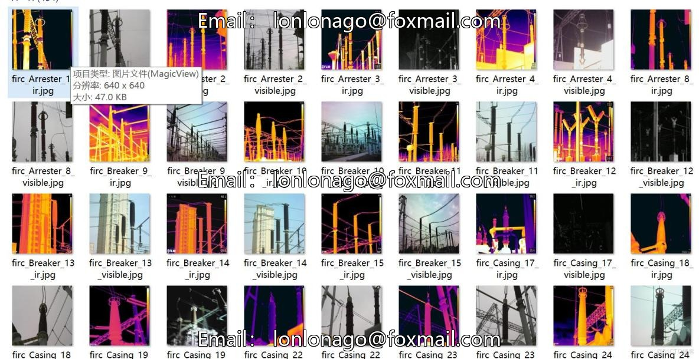
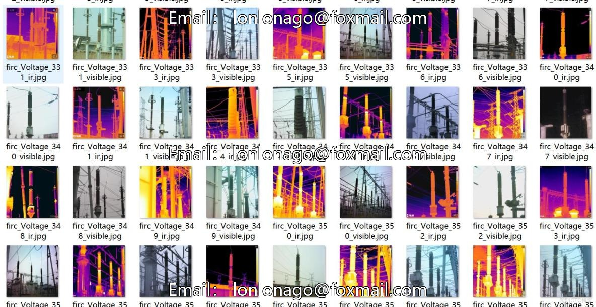
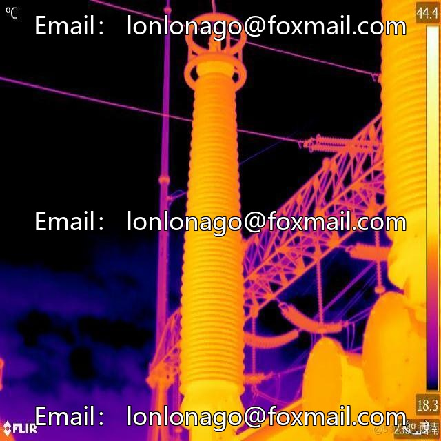
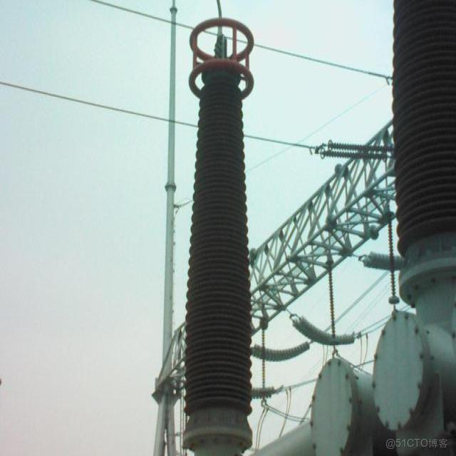

# Power Equipment Infrared and Visibility Images Alignment Dataset - 205 Pairs, Total 410 Images with No Annotation

The Power Equipment Infrared and Visibility Image Alignment Dataset is a collection of 205 pairs of power equipment images in both infrared and visible light. The purpose of this dataset is to 
facilitate research on image alignment.

All the images are unannotated, requiring researchers to perform feature matching and estimate transformation matrices themselves.

The dataset is organized as follows:
- c:\Users\Administrator\Downloads\data\
    └── JPEGImages\
├── firc_device_type_number_ir.jpg  # Infrared image
└── firc_device_type_number_visible.jpg  # Visibility image

The device types include:
- Arrester
- Breaker
- Casing
- Current Transformer
- Knife
- Voltage Transformer

Each device type has approximately 5 pairs, 7 pairs, 20 pairs, 35 pairs, and 80 pairs, respectively.

The format of the images is JPEG, with a total of 410 images across 205 pairs. The image size is 640x640.

No annotations are included in these images.

For usage, the images need geometric alignment between the infrared and visible light images.

Feature point matching methods (such as SIFT or ORB) are recommended for alignment.

Preprocessing can be combined with the physical characteristics of the infrared and visible light images.

A typical alignment process includes: feature extraction → feature matching → transformation estimation → image fusion.

It's important to note that there might be differences in perspective and scale between the infrared and visible light images. Some image pairs may have higher difficulty in alignment due to 
acquisition conditions. Proper data preprocessing can improve the success rate of alignment.

An image pair example is shown below:

## Images

Here is a pay link on Stripe ( https://buy.stripe.com/3cs8yP7sY87d0vu9AB ). Please contact me lonlonago@foxmail.com after funding $89, and I will send you a complete data files , thank you!

